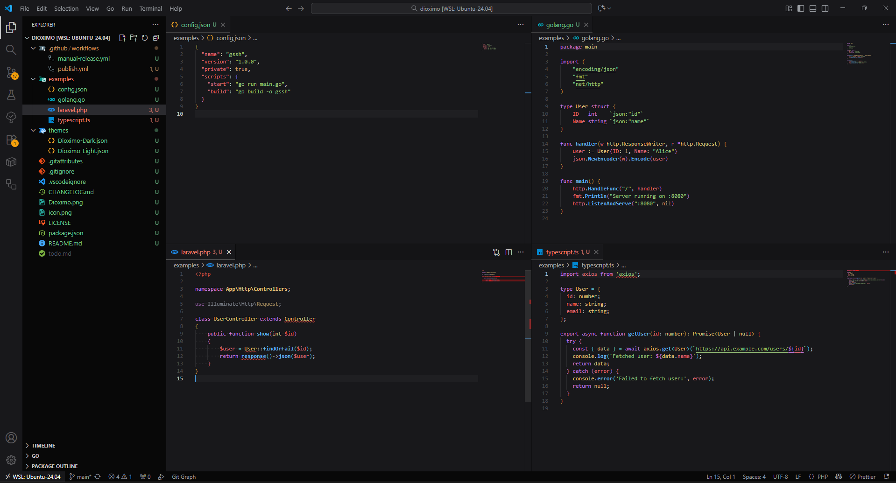

# Dioximo — A Visual Studio Code Color Theme

[](https://marketplace.visualstudio.com/items?itemName=omisai.dioximo)
[](https://github.com/omisai-tech/dioximo/releases)

<p align="center">
  
</p>


Dioximo is a carefully crafted Visual Studio Code color theme designed for comfortable long coding sessions. It offers balanced contrast, readable syntax colors, and subtle UI accents so your editor looks great and stays usable in both light and dark environments.

This repository contains the theme definition files used by the extension. Two variants are included:

- Dioximo Dark
- Dioximo Light

Repository: https://github.com/omisai-tech/dioximo

Extension identifier

- Publisher: `omisai`
- Name: `dioximo`
- Extension ID (Market place): `omisai.dioximo`

Table of contents

- [1. Installation](#installation)
- [2. Quick usage](#quick-usage)
- [3. Screenshots](#screenshots)
- [4. Color palette & examples](#color-palette-examples)
- [5. Customization](#customization)
- [6. Contributing](#contributing)
- [7. Sponsorship](#sponsorship)
- [8. License](#license)

## Installation

Install from the Visual Studio Code Marketplace (recommended):

1. Visit the marketplace page: https://marketplace.visualstudio.com/items?itemName=omisai.dioximo
2. Click "Install".

Install with the command-line (VS Code must be on your PATH):

```bash
code --install-extension omisai.dioximo
```

Install from a local VSIX file:

```bash
code --install-extension dioximo<version_number>.vsix
```

Or use the UI in VS Code: Extensions view → ... → "Install from VSIX..."

## Quick usage

1. Open Command Palette (Ctrl+Shift+P).
2. Type "Color Theme" and choose "Preferences: Color Theme".
3. Select either "Dioximo Dark" or "Dioximo Light".

## Screenshots




## Color palette & examples

The themes use a restrained palette focused on legibility and contrast. Typical mappings:

- Keywords: soft purple/blue
- Strings: warm orange
- Types / classes: medium teal
- Functions: bright blue
- Comments: muted gray (optionally italic)

## Customization

Override theme colors and token colors using your user or workspace settings. Example overrides:

```json
"workbench.colorCustomizations": {
	"editor.background": "#0f1011"
},
"editor.tokenColorCustomizations": {
	"textMateRules": [
		{
			"scope": "comment",
			"settings": {
				"fontStyle": "italic",
				"foreground": "#6a737d"
			}
		}
	]
}
```


## Contributing

Contributions and feedback are welcome. When opening issues or PRs, please include:

- VS Code version
- Operating system
- Theme variant (Dark or Light)
- Screenshots where appropriate

## Sponsorship

If you'd like to sponsor ongoing development, visit our GitHub Sponsors page:

https://github.com/sponsors/omisai-tech

For general issues, open an issue on the repository.

## License

This project is licensed under the terms found in the `LICENSE` file in the repository.